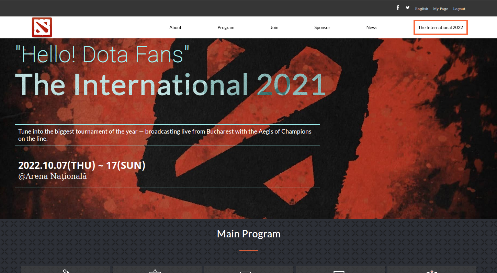
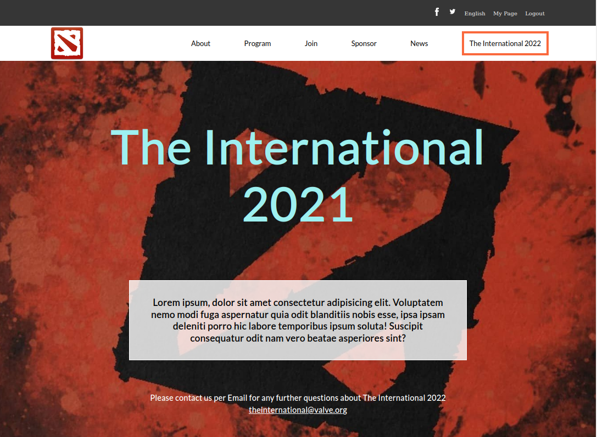

Dota The International 2022

> Website built for Microverse Capstone 1. The theme is Dota The International 2022

Webpage made using css and html, no frameworks involved. Used Javascript to display nabar and dynimcally render the speakers.

## Built With

- html
- CSS
- Javascript

## Live Demo

[Live Demo Link](https://lockless404.github.io/dotaCapstone/)

## Getting Started

To get a local copy up and running in your machine:

    1.Clone this repo or download the zip folder:

      git clone https://github.com/Lockless404/dotaCapstone.git

    2.Navigate to the location of the folder in your machine:

      you@your-Pc-name:~$ cd <folder>

## Authors

👤 Hamza Bin Ali Tarar

- GitHub: [@Lockless404](https://github.com/lockless404)

## 🤝 Contributing

Contributions, issues, and feature requests are welcome!

Feel free to check the [issues page](../../issues/).

## Show your support

Give a ⭐️ if you like this project!

## Acknowledgments

Original design idea by [Cindy Shin in Behance](https://www.behance.net/adagio07).

## 📝 License

This project is unlicensed.
